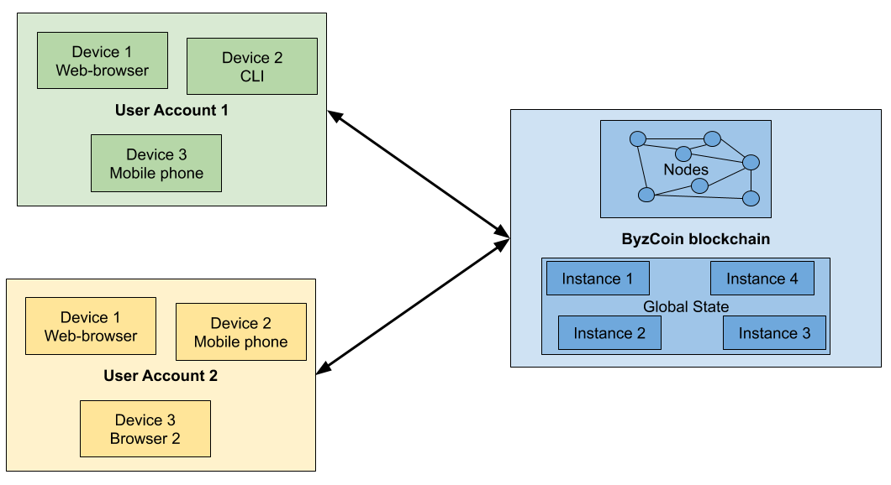
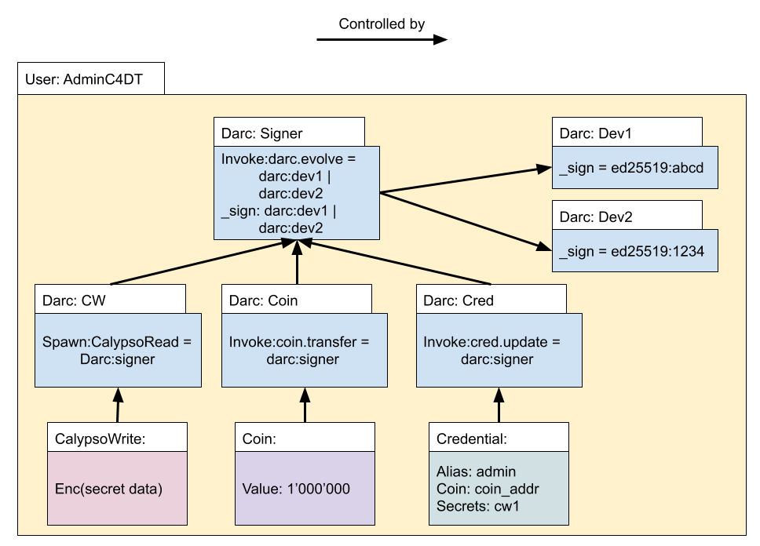
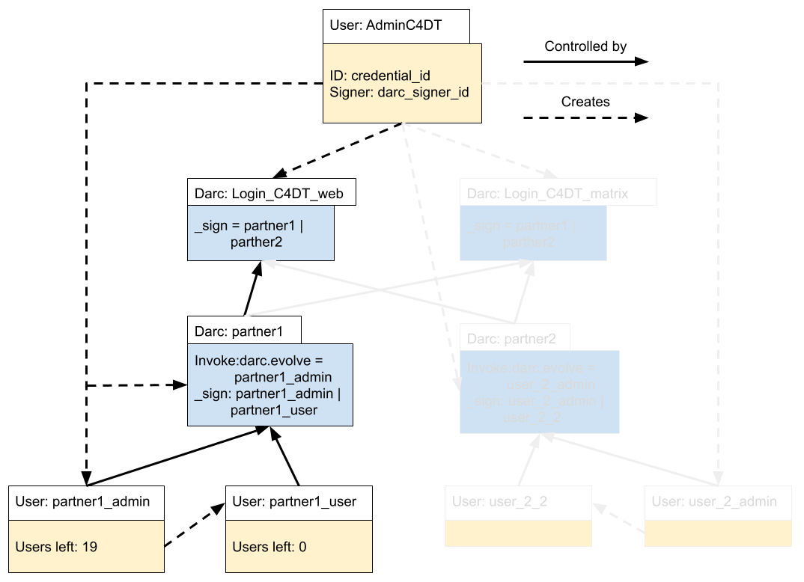
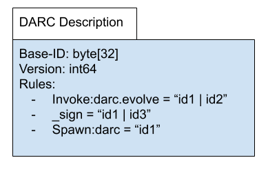

# DynaCred on ByzCoin

## General System Overview

The following figure shows a very rough overview of the different system parts that will be described in this document:

* ByzCoin blockchain: a set of nodes come to a consensus every n seconds on what the new _global state_ of the chain
should be. The global state consists of instances. Every instance: 
    * is linked to a contract defining what actions can be done (with a few exceptions like signer counters that 
    don’t have a contract attached) 
    * has a darc attached to it that defines the rules to execute the available actions 
    * has data that is stored in all nodes 
* User accounts are a set of different instances linked together as described in the rest of this document. One 
difference from other blockchains is the possibility to easily use different devices with separated keys that can be 
revoked on a per-device basis.

### Contracts and Instances

Similar to Ethereum, the global state of the ByzCoin network is a key/value storage where the value associated to a 
given key can evolve. This is different from Bitcoin, where every UTXO has only two states: spent and unspent.

Every key/value is called an instance in ByzCoin, as it is tied to a contract. It is similar to the object-oriented
naming: every class (a ByzCoin contract) can be instantiated in multiple objects (a ByzCoin key/value entry).

### Decentralized Access Rights Control (DARC)

Unlike Ethereum, updating the instances is not protected by a corresponding private key, but by a DARC. This structure
has a list of action/rules that define for each possible instruction to the instance what rule needs to be fulfilled for
ByzCoin to accept this instruction.

A unique feature of DARCs is the delegation, where one DARC can point to another DARC to indicate that the second DARC
is trusted. This makes it possible to implement a decentralized and federated access control in ByzCoin.

### Instructions and Transactions

Clients send one or more instructions for inclusion in the blockchain. If a transaction contains more than one
instruction, this means that all instructions must be applied atomically. If one of the instruction fails, the whole
transaction is rejected.

## User Management

Using DynaCred, one can have a simple user management on the ByzCoin blockchain. This user-management is decentralized,
as there is no one central login-server that controls access. Every user is self-sovereign and can update her
information however she likes.

The user management in ByzCoin uses the following contracts:

* DARC - the access to the user account is done using DARCs. This makes it easy to: 
    * add/revoke devices 
    * define sets of recovery accounts
* The most important DARC of the user is the _Signer_ DARC. All delegation from the active instances point to this
DARC. From here different devices are trusted, each implemented as a separate DARC.
* Credential - a special contract just for the user-management that implements a credential/attribute/value store.
There are some pre-defined credentials that are interpreted by the UIs, but the user is free to add new credentials.
Currently defined credentials are: 
    * Public: define all the attributes of the user that are publicly available 
    * Config: some configuration variables of the account 
    * Devices: a list of all devices linked to that account 
    * Recoveries: a list of all DARCs that are allowed to recover the account 
    * Calypso: a list of all stored secrets of this user 
* Coin - every operation on OmniLedger has a cost that will be deduced from the coin account of the user. Currently only the
creator of the OmniLedger network can fill up the coin accounts 
* CalypsoWrite - a secret stored in OmniLedger with the possibility of delegating decryption access

### Instances Figure

The following observations can be made about the user:

* The user already has 2 devices setup that are allowed to sign on behalf of the _signer_ darc 
* Each instance has its own darc that defines the rules specific to that instance. This is mostly for easier handling in the backend and to
separate the devices-darcs from the other darcs. 
* Each device darc represents one device that the user holds. A user can give access to his structure by adding a new 
device-darc with a new public key, and changing the __sign_ and _invoke:darc.evolve_ rules of the signer darc 
* The _signer_ darc is referenced by all the other darcs in the user.

### User Creation Details

Following are some details with regard to the creation of a new user by the spawner.

#### Costs

For a standard user, the following cost occurs:

* 4 darcs = 4 * 100 
* 1 coin = 1 * 100 
* 1 credential = 1 * 1’000

For more details, look at Appendix A. This is somewhat arbitrary, but reflects the idea that a credential is more load
to the system than a darc or a coin, as the credential will be updated more often and can grow larger in size.

#### Ephemeral Private Key

The standard setup of a new user should be like this:

1. The new user chooses a keypair and sends the public key to the admin 
2. The admin creates the new user using the
public key

However, to avoid the user having to send something to the admin, the current code does the following:

1. The admin 
    1. choses an ephemeral keypair 
    2. creates the new user with this keypair 
    3. Sends the private key to the new user 
2. The new user 
    4. Choses a random keypair 
    5. Evolves the device darc and replaces the ephemeral keypair of the admin with his own keypair

This allows the admin to directly send a signup link to a new user, without having to do a back-and-forth between the
new user and the admin. Once the device darc has been updated to the new keypair, the admin cannot change the darc
anymore.

If the system should allow recovery of the user by the admin, the user signer darc can point to a _recovery device darc_
that holds the public key of the admin. If needed, the admin can then evolve the signer darc to change the devices of
the user.

#### User Identities

The global ID of a user should be the _credentialID_, which is the instance ID of the credential instance, because it
allows to find all the different pieces of the user. This id should be used when exchanging contacts.

For referencing a user in a darc, the _darc:signer_ should be used, because it represents all the devices the user has
access to. If an application has the credentialID, it can get the credential-darc and the signer-darc very easily. The
inverse is not always possible.

### Creation of Actions and Groups

Darcs are very general and allow for multiple use-cases. For the C4DT demonstrator, we use them to implement the
following two use-cases:

* _Action_, which is not tied directly to an instance per se, but describes in its __sign_ rule who is allowed to
execute a certain action outside of the system. For the moment we use two actions in the C4DT demonstrator: 
    1. _Login_C4DT_web_ - defines which users are allowed to visit the restricted pages in the c4dt site. The logins are
    done anonymously, all users are mapped to only one web-user 
    2. _Login_C4DT_matrix_ - defines which users are allowed to use the SSO of matrix to login. 
    The logins are pseudonymous using parts of the credential-id of the user 
* _Group_, federating users together, and giving the possibility of handling users in a decentralized way. In the current
    demonstrator, each industrial partner will be in a group darc.

This setup allows to delegate the responsibility of creating and managing users to the partners, while giving C4DT
control to whom it allows to access its resources.

A typical setup looks like this:

# Appendix A - Details of Contracts

This section holds more details about the contracts used.

## Distributed Access Right Control

A central part of how ByzCoin handles the access rights are the DARCs. A darc is described in the paper
“[Chainiac](https://www.usenix.org/system/files/conference/usenixsecurity17/sec17-nikitin.pdf)” from Nikitin Kirill et
al. A darc

* is tied to one or more resources and holds rules that define who is allowed to access these resources 
* can be evolved, meaning that the rules can be changed. Every time a darc evolves, the darc version is increased by one 
* has an identity that is calculated by taking the hash of version 0 
* exists in offline mode (as described in the paper) and online mode (as used in byzcoin), the difference being how 
to prove what the latest version of the darc is

The following figure gives an overview of a darc:

The rules for darcs on byzcoin are of the following format:

_(invoke|spawn|delete):contractID(\.command)?_

A special rule named __sign_ is the delegation rule, that allows a darc to be used in another context.

Every rule is tied to an _expression_ made out of _identities_ and _operators_. An identity is either a public key
(currently only ed25519 and p256 are supported) or a darc. If the identity is a darc, then the __sign_ rule of that darc
is used to evaluate the expression.

The operators of the expression are:

* | for ORing identities together (either identity 1 OR identity 2 must sign) 
* & for ANDing identities together (identity 1 AND identity 2 must sign) 
* () for grouping operators

Future operators should include:

*   Thresh(n, id1, id2, …) for defining threshold signing

### Restricted and Unrestricted Darcs

For security reasons, normal, restricted darcs are not allowed to add new rules. This is to avoid that a user can evolve
a darc and be able to spawn instances without the consent of the admin.

Unrestricted darcs are allowed to add new rules.

The two darcs are implemented as two different contracts.

## Spawner Contract

The byzcoin system depends mainly on darcs to define who is allowed to create instances. For a general user handling,
this is not useful, as we want to limit the possibilities of users to create new instances. If every user could create
an infinite amount of instances, the system would very quickly be flooded. Using the available coins in byzcoin, a
spawner contract is defined by the main admin, which can be used to spawn new instances.

A Transaction that wants to spawn a new instance will have at least two instructions:

1. Fetch coins - remove coins from a coin instance and put it on the stack 
2. Spawn instance - call the spawner contract, which will consume the coins and create the instance

The second step can be repeated in the same transaction, as long as there are enough coins on the stack. The following
costs are defined in the spawner contract:

* Darc 
* Coin 
* Credential 
* CalypsoWrite 
* PopParty 
* RoPaSci (Rock Paper Scissors)
* Value

A special mention is the CalypsoWrite contract, as it must allow the spawning of CalypsoRead instances. To allow this,
the CalypsoWrite instance also has a ‘cost’ field that defines how many coins must be available before spawning a new
CalypsoRead instance.
