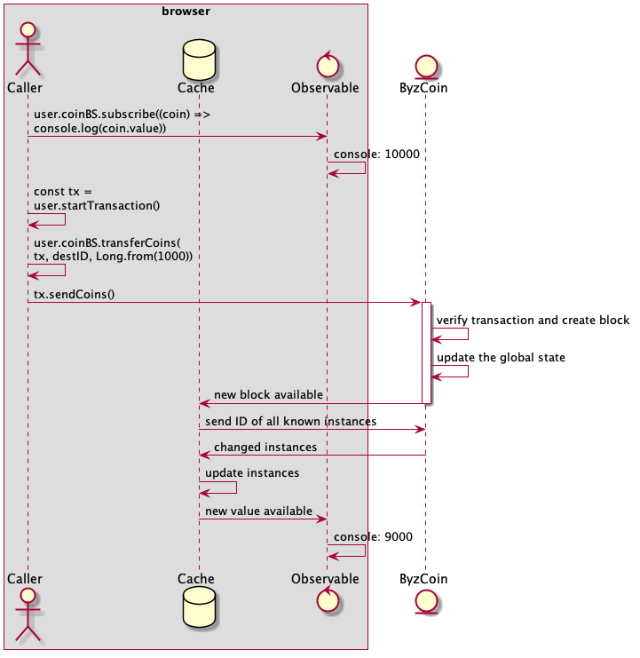

# Dynacred - the OmniLedger Wallet

This library implements a wallet in TypeScript that can be used to hold the private keys and to communicate with the 
instances in OmniLedger.
You can find a short summary of what OmniLedger can do here: https://c4dt.org/article/omniledger
Dynacred uses different smart contracts in OmniLedger to implement a simple user account system that can do the 
following:
- delegate operation on the account to other devices (browser, mobile phones, mobile app)
- keep ids of other accounts
- define Decentralized Access Rights Control [DARC](https://c4dt.org/article/darc), which can be used to
    - define recovery options
    - authenticate using CAS, compatible with WordPress, Matrix, Apache
    - protect [Calypso](https://c4dt.org/article/calypso) encrypted data
- encrypt and decrypt data using [Calypso](https://c4dt.org/article/calypso)

One of the next steps we'd like to do is to add access to the ByzCoin EVM, so that the wallet can be used to interact
 with the BEVM.
 
For more information about dynacred and byzcoin, see [DYNACRED](DYNACRED.md).
 
## What the wallet stores

The wallet itself is stored on the OmniLedger blockchain.
To access your wallet and modify it, you need to sign transactions with a private key to authenticate.
Dynacred stores your private key in the browser-DB.
As such you need to run your scripts always from the same host, else the library will not find the private key.
 
## Start with Dynacred

The easiest way to start with dynacred is to ask linus.gasser@epfl.ch for an account. 
You'll receive a link that can be opened in a browser and that will store the private key in your browser.
Once your set up you can start using the dynacred library in your own projects.
An example project is the [WebApp](../webapp), which uses nearly all of dynacred's functionalities.

# Library structure

This dynacred version makes extended use of rxjs observables to implement a reactive dynacred.
The library only needs to have the `credID` and the `privateKey` of the user.
All the rest is kept up-to-date by looking it up on the blockchain.

Every user has its own instance of the `User` class.
It needs access to a db (from the browser or mobile app) and to a `ByzCoinRPC` instance.
The `User` class is mostly an object with references to instances for all the user can do.

## Global State, Transactions, Blocks, Contracts, and Instances

A short recap of how the ByzCoin blockchain works.
From a data perspective, ByzCoin is inspired heavily from Ethereum.
Every ByzCoin node holds a copy of the `Global State` that reflects all the data known to the nodes.
To change the global state, a client must send a `Transaction` to one of the nodes.
All `Transaction`s are collected in `Blocks` that describe how the `Global State` evolves.
Once all nodes accepted the new `Block`, the new `Global State` is available.

The `Global State` holds a number of `Instances`.
Every `Instance` holds the following information (summarized):
- `ContractID`: points to the hardcoded behaviour of this instance
- `Data`: holds the updated state of this instance
- `DARC`: defines the invokable methods on this instance and how the rights are verified

The ByzCoin blockchain has a fixed number of `Contracts` that can only be changed by modifying the code of the nodes.
To allow for user-defined contracts, ByzCoin includes a full-fledged `Ethereum Virtual Machine`, `EVM`.

## Caching of the instances

A simple cache keeps track of all known instances and stores them locally.
Whenever a new block is created, the library is informed and updates all instances that have been changed.
Every update to an instance triggers a `next` on all `Observable`s that are linked to it.
Using a web-frontend that is aware of `Observable`s, e.g., Angular, you can keep all values up-to-date by using the 
`cred.alias | sync` pipeline.
 
If the library starts with a warm cache, all information is already available to the app.
As this information might be outdated, the first step is to fetch all updates from the blockchain.
Only the updated parts will be contacted.

## Modifying the Global State

Every method in dynacred that modifies the `Global State` needs to create an instruction.
All instructions are collected in a `ClientTransaction` and then sent to one of the nodes of ByzCoin.
To simplify the collection and the signature of these `Instruction`s, dynacred uses the `CredentialTransaction` class.
It abstracts the collection of the instructions and the signing of the final `ClientTransaction`.

The following is an example of the caller creating an observable on the `user.coinBS`, and then sending some
coins to another account:



### Details of Transactions and Instructions

A `Transaction` is made up of one or more `Instructions`.
Every `Instruction` has a `Type` and is sent to an existing `Instance`.
The `Type` can be one of:
- `Spawn`: create a new instance
- `Invoke`: call a method on an existing instance
- `Delete`: remove an instance

Every `Instruction` needs to be signed by a key that can be verified by the corresponding `Rule` of the `DARC`.

## Class structure

User is the basic class that holds references to all other classes that make up a user:

```
User
  + credStructBS: CredentialStructBS        // Holds all publicly available data from the user
  + coinBS: CoinBS                          // The coin instance of this user
  + addressBook: AddressBook                // A list of all other credentials known to this user, including
                                            // groups and actions
  + credSignerBS: CredentialSignerBS        // All devices having access to this credential
  + spawnerInstanceBS: SpawnerInstanceBS    // A link to the spawnerInstance for creating new instances
  + kpp: KeyPair                            // The keypair for this device
```

All the user's information are represented by the `CredentialStructBS` class.
This structure holds different information about the user and IDs of instances that also belong to the user.
All other instances of the user are represented by their own class:
- `coinBS`: is the main coin of the user
- `addressbook`: holds the `CredentialStructBS`s of the addresses found in `credStructBS.credPublic.contacts`
- `credSignerBS`: references all device-DARCs that can modify this credential
- `spawnerInstanceBS`: holds the spawner that can spawn new instances if paid for with the coin


The following two helper classes are used throughout the code.
`ByzCoinBuilder` can retrieve existing instances from ByzCoin to make them available locally.

```
ByzCoinBuilder > ByzCoinBS
  - retrieveUser(|By(Ephemeral|URL|Migration|DB))
  - retrieveAddressBook
  - retrieveUserKeyCredID
  - retrieveCoinBS
  - retrieveCredentialSignerBS
  - retrieveDarcsBS
  - retrieveDarcBS
  - retrieveSignerDarcBS
```

`CredentialTransaction` is a helper-class to change the state of ByzCoin.

```
CredentialTransaction > Transaction
  - sendCoins
  - spawnDarc(|Basic)
  - spawnCoin
  - spawnCredential
  - createUser
```

### Basic credential structure definitions

These all stem from the `CredentialStruct` class and allow an easy way to access eventual updates to the values. 
No interpretation is done that requires to query byzcoin.
So you'll find `Buffer` and `InstanceMap`, but no `Darc` or `Coin` in these definitions.

```
CredentialStructBS > BS<CredentialStruct>
  + id, darcID
  + CredentialPublic
  + CredentialConfig
  + credDevices: CredentialInstanceMapBS
  + credRecoveries: CredentialInstanceMapBS
  - getCredential(|InstanceMap)BS
  - (update|set)Credentials
```

```
CredentialBS > BS<Credential>
  - getAttribute(|BS|Buffer|String|InstanceSet)
  - setValue
  - rmValue
```

```
CredentialInstanceMapBS > BS<InstanceMap>
  - setInstanceSet
  - setValue
  - rmValue
```

```
Attribute(Buffer|String|Long|Point|Bool|Number|InstanceSet)BS > BS<*>
  - setValue(T)
```

```
CredentialPublic
  + contacts, alias, ...: Attribute*BS
```

```
CredentialConfig
  + view, spawner: Attribute*BS
```
  
```
InstanceSet
```

```
InstanceMap
```

### Structures that fetch more information from ByzCoin

As the `CredentialStruct` class points to other byzcoin-instances, these classes allow to interact directly with 
these instances.
Every one of these classes gives a `BehaviorSubject` access to the underlying byzcoin-instances, as well as methods 
to `WORM` the bc-instances.

#### AddressBook

The `AddressBook` represents the following DARCs of the `CredentialStruct`:
- `credPublic.contacts` as `ABContactsBS` - links to other credentials the user knows
- `credPublic.groups` as `ABGroupsBS` - groups the user follows
- `credPublic.actions` as `ABActionsBS` - actions, which are DARCs + a coin-instance for actions like login

Every field is set up as a `BehaviorSubject`, which means that there is a `getValue()` method to get the current 
value, but also a `.subscribe()` to be informed if anything changes.
If an element is removed or added, the `BehaviorSubject` calls `next` method on all observers.
If an element is changed, only the `BehaviorSubject` of this element is updated. 

```
AddressBook
  + ABContactsBS
  + ABGroupsBS
  + ABActionsBS
```

```
ABContactsBS > BS<CredentialStructBS[]>
  - create, link, unlink, rename
```

```
ABGroupsBS > BS<DarcsBS>
  - create, link, unlink, rename
```

```
ABActionsBS > BS<ActionBS[]>
  - create, link, unlink, rename
```

```
ActionBS
  + DarcBS
  + CoinBS
```
  
#### CredentialSigner

This class holds all `device`s and `recovery` darcs.
The `CredentialSigner` class itself inherits `DarcBS`, so it follows changes to the class
itself.
A `device` and a `recovery` are quite similar, in that both allow full control of the
`CredentialDarc`

```
CredentialSigner > DarcBS
  + devices: CSTypesBS
  + recoveries: CSTypesBS
```

```
CSTypesBS > DarcsBS
  - create, link, unlink, rename
```
  
### Classes that could be integrated in dedis/cothority

The following classes are generic and could find their way into @dedis/cothority
npm.
Every class representing an instance is a `BehaviorSubject` that gives an eventually
cached version of the instance, and calls `next` for every new version of the instance.

```
DarcsBS > BS<DarcBS[]>
```

```
DarcBS > BS<Darc>
  - evolve
  - (set|add|rm)signEvolve
```

```
CoinBS
  - transfer
```

```
Transaction
  - send
  - (spawn|invoke|delete)
```

## Next steps

- calypso support for identity attributes (email, webpage)
- sharable address-book
- BEvm support
